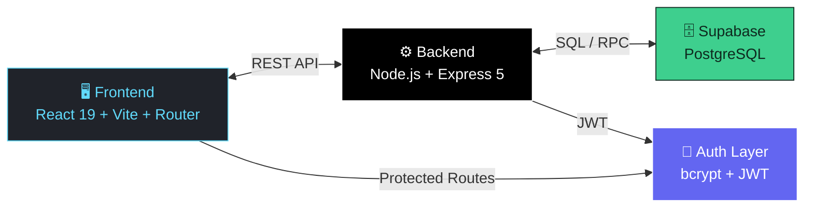
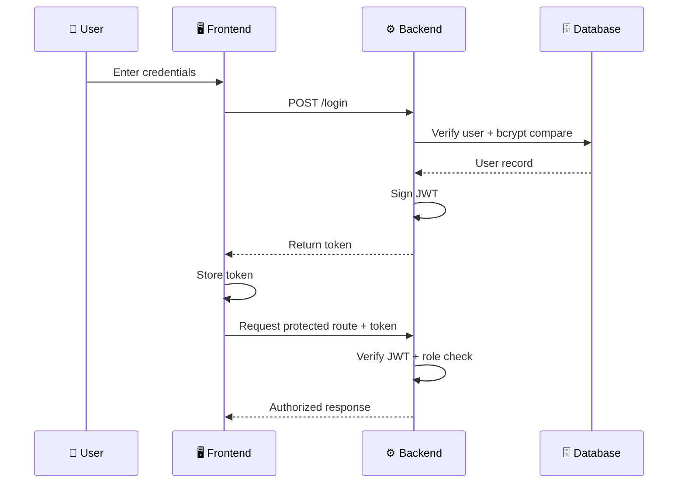

<div align="center">

# 🎓 CampusConnect

### *One Platform. Every Voice on Campus.*


<br/>

[](https://react.dev/)
[](https://vitejs.dev/)
[](https://nodejs.org/)
[](https://expressjs.com/)
[](https://supabase.com/)
[](https://jwt.io/)
[](LICENSE)

[](https://github.com/your-username/CampusConnect/stargazers)
[](https://github.com/your-username/CampusConnect/network/members)
[](https://github.com/your-username/CampusConnect/issues)
[](CONTRIBUTING.md)

<br/>


</div>

<br/>

<div align="center">

</div>

<br/>

## 🌟 Overview

> **CampusConnect** is a modern, **role-aware campus engagement platform** that unifies announcements, events, and clubs into one intelligent experience — purpose-built for **students**, **faculty**, and **admins**.

No more scattered WhatsApp groups, missed notices, or fragmented club pages. CampusConnect gives every member of a campus community a personalized dashboard, a single source of truth, and a smooth, secure way to stay in the loop.

<table>
<tr>
<td width="50%" valign="top">

### 😩 The Problem
- 📢 Announcements lost across notice boards & group chats
- 🎭 No unified way to discover clubs & events
- 🔓 No role-based control over who can post what
- 📵 Zero personalization — everyone sees everything

</td>
<td width="50%" valign="top">

### ✅ The CampusConnect Fix
- 📌 Centralized, role-aware announcement feed
- 🗓️ Unified event calendar & club discovery hub
- 🛡️ Granular access for Student / Faculty / Admin
- 🎯 Personalized dashboards built around *you*

</td>
</tr>
</table>

---

## 📑 Table of Contents

- [✨ Core Features](#-core-features)
- [🧱 Architecture](#-architecture-overview)
- [🛠️ Tech Stack](#️-tech-stack)
- [📂 Project Structure](#-project-structure)
- [👥 User Roles](#-user-roles--permissions)
- [🔐 Authentication Flow](#-authentication-flow)
- [🚀 Getting Started](#-getting-started)
- [🗄️ Database Schema](#️-database-schema)
- [📈 Roadmap](#-roadmap)
- [🤝 Contributing](#-contributing)
- [📄 License](#-license)

---

## ✨ Core Features

<table>
<tr>
<td width="33%" valign="top">

### 📢 Announcements
Role-aware announcement feed for students, faculty & admins with department-level targeting and instant visibility control.

</td>
<td width="33%" valign="top">

### 🗓️ Events
Create, browse, and RSVP to campus events with category & department filters, plus a personal event calendar.

</td>
<td width="33%" valign="top">

### 🏛️ Clubs
Discover clubs, request membership, and collaborate through club-only forums, posts, and threaded comments.

</td>
</tr>
<tr>
<td width="33%" valign="top">

### 📌 Save for Later
Bookmark announcements and events to a personal saved feed — accessible anytime, from any device.

</td>
<td width="33%" valign="top">

### 🛡️ Secure Auth
JWT-based authentication with bcrypt password hashing and fully protected, role-checked routes.

</td>
<td width="33%" valign="top">

### 🎛️ Role Dashboards
Purpose-built dashboards — students explore, faculty publish, admins govern — each tailored to the job at hand.

</td>
</tr>
</table>

---

## 🧱 Architecture Overview

CampusConnect follows a clean, modern **full-stack** pattern — decoupled frontend, RESTful backend, and a managed Postgres data layer.



| Layer | Responsibility |
|---|---|
| **Frontend** | React + Vite SPA rendering role-based dashboards, forms & feeds |
| **Backend** | Express REST API — controllers, routes, auth & authorization middleware |
| **Database** | Supabase PostgreSQL — users, clubs, events, announcements, forums |
| **Auth** | JWT issuance + verification, bcrypt hashing, route-level role checks |

---

## 🛠️ Tech Stack

<div align="center">

| Category | Technologies |
|---|---|
| **Frontend** |     |
| **Backend** |     |
| **Database** |   |
| **Tooling** |   |

</div>

---

## 📂 Project Structure

```text
CampusConnect/
├── Backend/
│   ├── controllers/          # Business logic per resource
│   │   ├── adminController.js
│   │   ├── announcementsController.js
│   │   ├── clubForumController.js
│   │   ├── clubsController.js
│   │   ├── eventsController.js
│   │   ├── savedController.js
│   │   └── usersController.js
│   ├── modules/               # Auth & DB utilities
│   │   ├── auth.js
│   │   ├── authMiddleware.js
│   │   ├── authorize.js
│   │   └── dbUtil.js
│   ├── routes/                # Express route definitions
│   ├── database.js            # Supabase client init
│   ├── supabase_schema.sql    # Full DB schema
│   └── index.js               # App entry point
│
├── Frontend/
│   ├── src/
│   │   ├── api/                # API client layer
│   │   ├── components/
│   │   │   ├── cards/           # Announcement / event / club cards
│   │   │   ├── common/          # Shared UI primitives
│   │   │   ├── forms/           # Create/edit forms
│   │   │   └── icons/
│   │   ├── contexts/            # Global state (auth, etc.)
│   │   ├── layouts/             # Role-based layout shells
│   │   ├── pages/
│   │   │   ├── admin/            # Dashboard, CreateClub, JoinRequests...
│   │   │   ├── faculty/          # Dashboard, CreateEvent, Saved...
│   │   │   ├── student/          # Dashboard, ClubHub, EventCalendar...
│   │   │   └── public/           # Landing, login, signup
│   │   ├── routes/              # Route guards & role routing
│   │   └── styles/               # Page/component/layout styles
│   └── vite.config.js
│
└── README.md
```

---

## 👥 User Roles & Permissions

<div align="center">

| Role | Dashboard | Create Content | Manage Clubs | Approve Requests |
|:---:|:---:|:---:|:---:|:---:|
| 🧑‍🎓 **Student** | ✅ Personalized feed | ❌ | 🔸 Join only | ❌ |
| 🧑‍🏫 **Faculty** | ✅ Publishing tools | ✅ Announcements & Events | ❌ | ❌ |
| 🛡️ **Admin** | ✅ Full control center | ✅ Everything | ✅ Create & manage | ✅ Approve/reject |

</div>

- **Student** — explores announcements, events & clubs; joins clubs; saves favorites; posts in club forums
- **Faculty** — publishes announcements & events; manages own saved content
- **Admin** — creates clubs & announcements, reviews join requests, oversees platform-wide content

---

## 🔐 Authentication Flow



1. 🔑 User signs up or logs in
2. 🔒 Backend validates credentials with bcrypt
3. 🎟️ A JWT is issued and returned to the client
4. 🛡️ Protected routes verify the token & role before granting access

---

## 🚀 Getting Started

### ✅ Prerequisites

  

### 1️⃣ Clone the repository

```bash
git clone https://github.com/your-username/CampusConnect.git
cd CampusConnect
```

### 2️⃣ Install dependencies

```bash
# Frontend
cd Frontend
npm install

# Backend
cd ../Backend
npm install
```

### 3️⃣ Configure environment variables

Create a `.env` file inside `Backend/`:

```env
SUPABASE_URL=your_supabase_url
SUPABASE_SERVICE_ROLE_KEY=your_service_role_key
PORT=5001
FRONTEND_ORIGINS=http://localhost:5173,http://127.0.0.1:5173
JWT_SECRET=your_secret_key
```

> 💡 For the frontend, add your Supabase anon values to `Frontend/.env` if you plan to use the client directly.

### 4️⃣ Set up the database

Run `Backend/supabase_schema.sql` inside your **Supabase SQL Editor** to create all required tables.

### 5️⃣ Run the app

```bash
# Terminal 1 — Backend
cd Backend
npm start

# Terminal 2 — Frontend
cd Frontend
npm run dev
```

<div align="center">

| Service | URL |
|---|---|
| 🖥️ Frontend | http://localhost:5173 |
| ⚙️ Backend | http://localhost:5001 |

</div>

---

## 🗄️ Database Schema

<details>
<summary><b>📋 Click to view core tables</b></summary>

| Table | Purpose |
|---|---|
| `users` | Accounts with role (`student` / `faculty` / `admin`), department, interests |
| `clubs` | Club metadata & imagery |
| `user_clubs` | Membership + join request status (`pending` / `approved` / `rejected`) |
| `announcements` | Role & department-targeted notices |
| `events` | Campus events with category, department, and date |
| `saved_announcements` | Per-user bookmarked announcements |
| `saved_events` | Per-user bookmarked events |
| `club_posts` | Club forum posts |
| `club_comments` | Threaded comments on club posts |

</details>

---

## 📈 Roadmap

- [ ] 🤖 AI-based recommendations for announcements & events
- [ ] 🔔 Real-time notifications & activity feeds
- [ ] 📊 Advanced analytics for campus engagement
- [ ] 📱 Mobile-first enhancements & PWA support
- [ ] 🧹 Expanded moderation & role management tools

---

## 🤝 Contributing

Contributions make the open-source community an incredible place to learn and build. Any contributions are **greatly appreciated**! 🎉

1. Fork the repo
2. Create your feature branch (`git checkout -b feature/AmazingFeature`)
3. Commit your changes (`git commit -m 'Add some AmazingFeature'`)
4. Push to the branch (`git push origin feature/AmazingFeature`)
5. Open a Pull Request

---

## 📄 License

Distributed under the **MIT License**. See [`LICENSE`](LICENSE) for details.

---

<div align="center">


**Crafted with passion❤️ and a lot of coffee ☕️**
</div>
<div align="center">
- Tirth Gujarati

</div>
